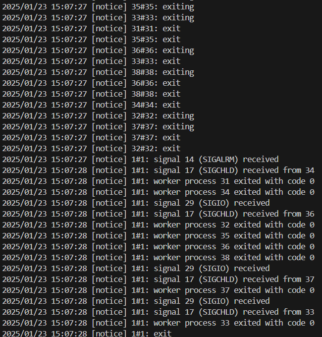

# docker-nginx-laba

# Выполнил Квасков Владислав ИС-22
#  [Ссылка на образ](https://hub.docker.com/repository/docker/wwwwv/custom-nginx/general)

## Задача 1

Сценарий выполнения задачи:

- Установил docker и docker compose plugin на свою linux рабочую станцию или ВМ.

- Зарегистрировал и создал публичный репозиторий  с именем "custom-nginx" на https://hub.docker.com;

- скачал образ nginx:1.21.1;

- Создал Dockerfile ```(nano Dockerfile)``` и реализовал в нем замену дефолтной индекс-страницы(/usr/share/nginx/html/index.html), на файл index.html с содержимым:

```html

<html>
<head>
Hey, ZGU!
</head>
<body>
<p>I will be IT Engineer!</p>
</body>
</html>

```

- Собрал и отправил созданный образ в свой dockerhub-репозитории c tag 1.0.0. <br>
```docker build -t custom-nginx:1.0.0 .```

## Задача 2

1. Запустил образ custom-nginx:1.0.0 командой docker run в соответвии с требованиями:
- имя контейнера "ФИО-custom-nginx-t2"
- контейнер работает в фоне
- контейнер опубликован на порту хост системы 127.0.0.1:8080
  ```
  docker run -d --name KVV-custom-nginx-t2 -p 127.0.0.1:8080:80 custom-nginx:1.0.0
  ```

2. Не удаляя, переименовал контейнер в "custom-nginx-t2"
   ```docker rename KVV-custom-nginx-t2 custom-nginx-t2```

4. Выполнил команду ```date +"%d-%m-%Y %T.%N %Z" ; sleep 0.150 ; docker ps ; ss -tlpn | grep 127.0.0.1:8080  ; docker logs custom-nginx-t2 -n1 ; docker exec -it custom-nginx-t2 base64 /usr/share/nginx/html/index.html```

5. Убедился с помощью curl или веб браузера, что индекс-страница доступна.<br>
   ```curl http://127.0.0.1:8080```





## Задача 3

1. Воспользуйтесь docker help или google, чтобы узнать как подключиться к стандартному потоку ввода/вывода/ошибок контейнера "custom-nginx-t2".
```docker attach custom-nginx-t2``` 

1. Подключился к контейнеру и нажмите комбинацию Ctrl-C.


2. Выполнил ```docker ps -a```.


3. Перезапустил контейнер<br>
  ```docker restart custom-nginx-t2```

4. Зашел в интерактивный терминал контейнера "custom-nginx-t2" с оболочкой bash.<br>
   ```docker exec -it custom-nginx-t2 /bin/bash```

5. Установил nano с помощью apt-get.<br>
  ```docker exec -it custom-nginx-t2 bash```
 ``` apt-get update && apt-get install -y nano```

  
6. Отредактировал файл "/etc/nginx/conf.d/default.conf", заменив порт "listen 80" на "listen 81".<br>
    ```nano /etc/nginx/conf.d/default.conf```


7. Выполнил команду ```nginx -s reload```, а затем внутри контейнера <br>
```curl http://127.0.0.1:80 ; curl http://127.0.0.1:81```.


8. Вышел из контейнера, набрав в консоли  ```exit```.

9. Удалил запущенный контейнер "custom-nginx-t2", не останавливая его.<br>
    ```docker rm -f custom-nginx-t2```

## Задача 4

- Запустил первый контейнер из образа ***centos*** в фоновом режиме, подключив папку  текущий рабочий каталог ```$(pwd)``` на хостовой машине в ```/data``` контейнера, используя ключ -v.<br>
  ```docker run -d -v ${pwd}:/data centos /bin/bash -c "while true; do sleep 1000; done"```

- Запустил второй контейнер из образа ***debian*** в фоновом режиме, подключив текущий рабочий каталог ```$(pwd)``` в ```/data``` контейнера.<br>
  ```docker run -d -v ${pwd}:/data debian /bin/bash -c "while true; do sleep 1000; done"```d

- Подключился к первому контейнеру с помощью ```docker exec``` и создал текстовый файл любого содержания в ```/data```.<br>
  ```docker exec -it <container_id> /bin/bash```
  ```touch /data/test.txt```

- Добавил ещё один файл в текущий каталог ```$(pwd)``` на хостовой машине.<br>
  ```"" | Out-File -FilePath ${PWD}/secondfile.txt```

- Подключился во второй контейнер и отобразил листинг и содержание файлов в ```/data``` контейнера.
  ```docker exec -it <container_id> /bin/bash```
  ```ls /data```


## Задача 5

1. Создал отдельную директорию(например /tmp/ZGU/docker/task) и 2 файла внутри него.
"compose.yaml" с содержимым:

```
version: "3"
services:
  portainer:
    network_mode: host
    image: portainer/portainer-ce:latest
    volumes:
      - /var/run/docker.sock:/var/run/docker.sock
```

"docker-compose.yaml" с содержимым:

```
version: "3"
services:
  registry:
    image: registry:2

    ports:
    - "5000:5000"
```

- выполнил команду "docker compose up -d".
```Запущен compose т.к он основной```

2. Отредактировал файл compose.yaml так, чтобы были запущенны оба файла.

3. Выполнил в консоли хостовой ОС необходимые команды чтобы залить образ custom-nginx как custom-nginx:latest в запущенное вами, локальное registry.


4. Открыл страницу "https://127.0.0.1:9000" и произвел начальную настройку portainer.(логин и пароль адмнистратора)

5. Открыл страницу "http://127.0.0.1:9000/#!/home", выбрал local  окружение. Перешел на вкладку "stacks" и в "web editor" задеплоил следующий компоуз:

```
version: '3'

services:
  nginx:
    image: 127.0.0.1:5000/custom-nginx
    ports:
      - "9090:80"
```


6. Перейшел на страницу "http://127.0.0.1:9000/#!/2/docker/containers", выбрал контейнер с nginx и нажал на кнопку "inspect". В представлении <> Tree развернул поле "Config" и сделал скриншот от поля "AppArmorProfile" до "Driver".


7. Удалил из манифеста compose.yaml 
```rm compose.yaml```

- выполнил:
```docker compose up -d```

- устранил ошибку командой:
```docker compose up -d --remove-orphans```

- погасил compose-проект
```docker compose down```


